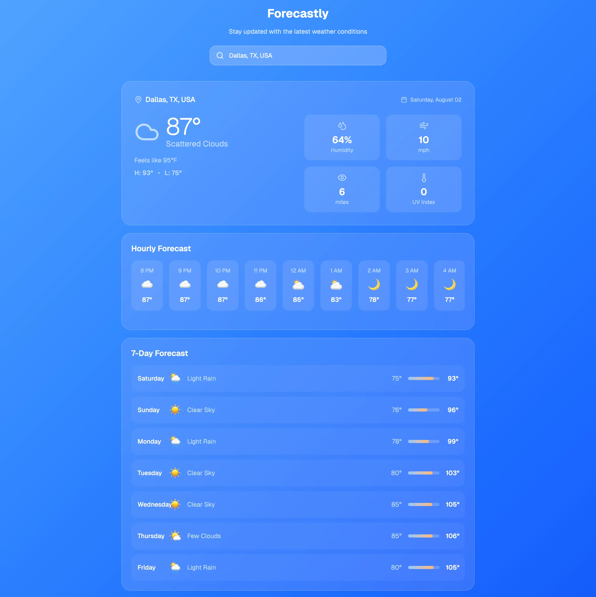

# Forecastly - Modern Weather Forecast Application
  A responsive weather forecasting application built with Ruby on Rails, featuring real-time weather data, intelligent address
  autocomplete, and modern UI components.
# Demo
http://137.184.215.0/

  
  ## Features
  ### Weather Forecasting
  - **Real-time weather data** from OpenWeather API
  - **Current conditions** with temperature, humidity, wind speed, and visibility
  - **Hourly forecasts** for the next 24 hours
  - **7-day outlook** with daily high/low temperatures
  - **Intelligent caching** to minimize API calls and improve performance
  ### Smart Location Search
  - **Google Places integration** for accurate city autocomplete
  - **Keyboard navigation** support (arrow keys, enter, escape)
  - **US cities focus** with geographic coordinate retrieval
  - **Auto-detection** of user location with fallback options
  ### Modern User Interface
  - **Responsive design** built with Tailwind CSS
  - **Component-based architecture** using ViewComponent
  - **Real-time updates** with Hotwire/Stimulus
  - **Toast notifications** for user feedback
  - **Loading states** with elegant spinners
  ### Performance & Reliability
  - **Caching** using Solid Cache for optimal response times
  - **Rate limiting** to prevent API abuse
  - **Circuit breaker pattern** for API resilience
  - **Error handling** with graceful degradation
  ## Technology Stack
  ### Backend
  - **Ruby on Rails 8.0+** - Web application framework
  - **SQLite** - Cache database
  - **Solid Cache** - Caching and session storage
  - **ActiveInteraction** - Business logic organization
  - **ViewComponent** - Reusable UI components
  ### Frontend
  - **Hotwire (Turbo + Stimulus)** - Modern web app behavior
  - **Tailwind CSS V4** - Utility-first styling
  - **Lucide Icons** - Beautiful iconography
  - **Toastify.js** - Toast notifications
  - **Spin.js** - Loading state
  ### APIs & Services
  - **OpenWeather API** - Weather data provider
  - **Google Places API** - Address autocomplete
  - **Geocoder gem** - Location services
  ### Development & Deployment
  - **Kamal** - Modern deployment pipeline
  - **GitHub Actions** - CI/CD automation
  - **Docker** - Containerization
  - **Minitest** - Testing framework with snapshot testing
  ## Quick Start
  ### Prerequisites
  - Ruby 3.4+ installed
  - Git installed
  ### Installation
  1. **Clone the repository**
     ```bash
     git clone https://github.com/ujackson/forecastly.git
     cd forecastly
  2. Install dependencies
  bundle install
  3. Environment setup
  cp .env.example .env
  3. Edit .env and add your API keys:
  OPENWEATHER_API_KEY=your_openweather_api_key
  GOOGLE_PLACES_API_KEY=your_google_places_api_key
  GEOCODER_KEY=your_geocoder_key
  4. Solid Cache Database setup
  rails db:prepare
  rails db:migrate
  5. Start the development server
  ./bin/dev
  6. Visit the application
  Open http://localhost:3000 in your browser
  API Key Setup
  OpenWeather API
  1. Sign up at https://openweathermap.org/api
  2. Subscribe to the "One Call API 3.0" plan
  3. Copy your API key to the .env file
  Google Places API
  1. Visit https://console.cloud.google.com
  2. Enable the Places API
  3. Create an API key with Places API restrictions
  4. Copy your API key to the .env file
  Development
  Running Tests
  # Run all tests
  rails test
  # Run linter
  bundle exec rubocop -A
  # Data Flow
  1. User Input → Address autocomplete via Google Places API
  2. Location Selection → Coordinate extraction and validation
  3. Weather Request → OpenWeather API call with caching
  4. Data Processing → Weather data formatting and validation
  5. UI Update → Component rendering with Turbo Streams
